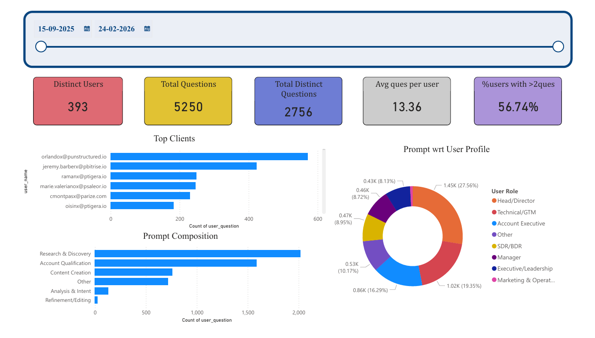

# reo-copilot-usage-analytics
Power BI analysis of Copilot chatbot usage — take-home data assignment

# Reo Copilot Usage & Performance Analysis

## Overview
Take-home data analysis assignment completed as part of Reo.dev's hiring process. The brief: analyze usage data for Reo Copilot (an in-product AI assistant, similar to ChatGPT embedded inside the Reo platform) and turn it into actionable insights for the product team.

**Turnaround:** Assigned Monday, delivered by Wednesday EOD.

## The Brief
Given a raw usage dataset, the ask was to:
1. Identify key KPIs to track Copilot usage and performance
2. Build a dashboard visualizing these KPIs and their trends
3. Derive insights and recommend ways to improve the metrics

## Approach
I structured the analysis around four dimensions to capture *how* users interact with the tool, the *effort* behind each interaction, and the *business context* driving usage:

- **Job role of user** — Analysis & Intent, Account Qualification, Content Creation, Research & Discovery, Refinement/Editing, Other
- **Complexity score** — Simple, Medium, Complex (mapped to the reasoning effort each question type requires)
- **Question category** — Account Research, Account Research & Qualification, Sales Outreach, Developer/Tech Focus, Other
- **Company domain** — segmented by user's organization for account-level views

*Note: client domains and usernames in the dataset were pre-anonymized by Reo.dev before being shared for this assignment.*

## Key Findings
- **Adoption is strong and sticky** — 393 users generated 5,250 questions, with 56.7% of users asking more than 2 questions, suggesting the tool is embedded in daily workflow rather than a one-off novelty
- **Nearly half of usage is high-value** — 47% of questions map to revenue-driving tasks (Account Qualification, Content Creation, Analysis & Intent)
- **Prompt quality is high** — only ~0.5% of questions were refinements/edits, meaning users rarely need to correct the tool's output
- **Leadership drives adoption** — Heads/Directors alone accounted for 1,447 questions, the largest single segment
- **Complexity is substantial but not extreme** — 79.6% of questions were medium complexity, 19.8% complex — users trust the tool with real tasks, not just trivial lookups

## Scope for Improvement
- **Analysis & Intent is underused** (only 2.5% of questions) — a missed opportunity for deeper strategic/analytical use cases
- Recommended tracking **session duration via API timestamps** to measure engagement depth beyond raw question counts, and to catch drop-off points

## Recommendations Delivered
1. Add lightweight thumbs up/down feedback after periods of inactivity to capture sentiment
2. Introduce guided prompt suggestions to nudge usage toward underused strategic workflows
3. Build a domain/team-aware recommendation layer to surface relevant prompts by company context

## Files
- `dashboard_export.pdf` — Full Power BI dashboard export
- `analysis_summary.pdf` — Written
